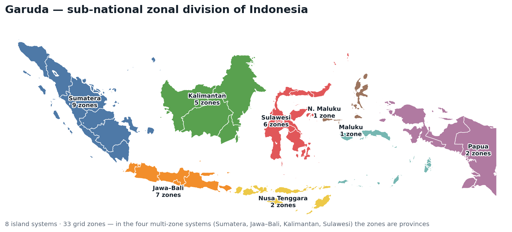

# Garuda — Grid And Renewable Utilization & Deployment Analysis

[](https://github.com/kaarthi19/garuda/actions/workflows/ci.yml)

**A sub-national, open-source energy-transition platform for Indonesia.**

Garuda is a zonal capacity-expansion and operational model that resolves
Indonesia's power system at **sub-national granularity** — islands → grid
**zones** → individual **village / industrial sites** — so that planners,
developers and researchers can study *what to build where, how a fleet operates,
and where it falls short*, at a resolution national models average away. It is
written in **Julia** (using [JuMP](https://jump.dev/)) with a **Python** tooling
layer, and runs end-to-end on the open-source **HiGHS** solver — **no commercial
licence required**.

The platform exposes one **zonal data core** to several **analysis engines**, each
matched to a different question and compute budget — from an instant, solver-free
screen to a full capacity-expansion optimisation.



*Indonesia resolved into **33 grid zones** across **8 island systems** — in the four
multi-zone systems (Sumatera, Jawa–Bali, Kalimantan, Sulawesi) the zones are
provinces; zones further resolve to individual village / industrial sites where the
data supports it (e.g. the Timor / NTT case — see
[`docs/case_study_timor.md`](docs/case_study_timor.md)). Province boundaries from
public Indonesian administrative data; regenerate with `python
tools/plot_zones_map.py`.*

---

## The analysis engines

| Engine | Question it answers | Cost | How to run |
|--------|---------------------|------|-----------|
| **Screening** | *Roughly, where does this zone stand today?* — emissions, RE share, reliability gaps of the existing fleet | none (arithmetic) | `python tools/screening.py data_indonesia/2030/maluku` |
| **RE resource & siting** | *What renewable headroom does a zone/site have?* — developable solar/wind MW, capacity factor, annual potential | none | `python tools/re_resource.py data_indonesia/2030/sulawesi` |
| **Dispatch / reliability** | *Exactly how does this fleet run, and where does it fall short?* — hourly dispatch, LOLE, shortage hours | LP (fast) | config key `"engine":"dispatch"` → `run_model.jl` |
| **Capacity expansion** | *What is the least-cost fleet to build?* — investment + dispatch under policy constraints | MILP | `run_model.jl` (default) |

The first two need only Python (`pandas`/`numpy`) — they run on a laptop with no
Julia and no solver. The dispatch and expansion engines share **one model
definition** (`build_model!`), so their results are guaranteed consistent; the
dispatch engine simply fixes capacity and (by default) relaxes unit commitment to
a fast LP. See [`docs/re_resource.md`](docs/re_resource.md) for the resource
engine and [`MODEL.md`](MODEL.md) for the optimisation formulation.

## Interoperability & experience

| Tool | What it does | How to run |
|------|--------------|-----------|
| **PyPSA export** | Hand the zonal network to [PyPSA](https://pypsa.org) (buses, links, generators, storage, loads, snapshots) instead of competing with it | `python tools/export_pypsa.py data_indonesia/2030/sulawesi --netcdf out.nc` |
| **Parity check** | Prove the export reproduces the garuda dispatch engine (system-total unserved matches to 0.0000 % on maluku and a 6-zone grid-only sulawesi case) | `python tools/validate_pypsa_parity.py <folder> --reference <results_dir>` |
| **Run launcher** | Validate inputs, preview scenario size + ETA, scaffold a config, optionally launch | `python tools/launcher.py --island maluku --year 2030 --scenario base --clean reference` |
| **Auto-report** | Result CSVs → one shareable HTML + PDF (headline metrics, mix/cost charts, per-zone reliability); `--lang id` renders it in Bahasa Indonesia | `python tools/report.py results/base_maluku_2030_reference` |
| **Coordination value** | The standalone-vs-coordinated delta (cost, diesel, emissions, unserved energy avoided) as one command — compare two runs, or solve both on HiGHS then compare. It can legitimately come out **zero**: on the full 780-village Timor case it does ([the measurement](docs/coordination_findings_timor.md)) | `python tools/coordination_value.py run --island timor_demo --year 2030` |
| **Sensitivity sweeps** | How robust is the plan? Perturb fuel price / demand / solar CF / connection cost / interconnection cap / import & export prices around a base case (auditable dataset variants), solve each, summarise the ranges | `python tools/sensitivity.py run --island timor_demo --year 2030 --scenario gridvillage --param fuel=0.8,1.2` |
| **Grid demand for Timor** | Give the Timor grid bus a real load (derived from the NTT zone-2 series, net of village load) plus a transplanted fleet, so village→grid **export** becomes a question the model can answer at all | `python -m tools.ntt.build_grid_demand --share 0.42 --out-dataset timor__market --fleet rescale` |

See [`docs/pypsa_export.md`](docs/pypsa_export.md),
[`docs/experience_layer.md`](docs/experience_layer.md),
[`docs/coordination_value.md`](docs/coordination_value.md) and
[`docs/sensitivity.md`](docs/sensitivity.md). The PyPSA export and the
report's PDF need `pip install pypsa matplotlib jinja2`.

---

## Quick start

**Prerequisites:** [Julia](https://julialang.org/downloads/) (tested with 1.12;
`Manifest.toml` pins exact versions) and Python ≥ 3.8. **No commercial solver
licence is needed** — HiGHS is bundled and used by default. See
[`docs/environment_setup.md`](docs/environment_setup.md) for Windows/conda notes.

```bash
# 1) Python deps (engines, validator, job runners)
pip install pandas numpy click pyyaml

# 2) Bootstrap the Julia environment once (installs packages, checks HiGHS)
julia --project=. bootstrap.jl

# 3) An instant, solver-free look at an island
python tools/screening.py data_indonesia/2030/maluku

# 4) Validate, preview and run a scenario in one step — the launcher scaffolds the
#    config and shells out to the solver. Dispatch is a fast LP on HiGHS (seconds
#    to a few minutes); a full capacity-expansion run is much slower on HiGHS
#    (~25 min for this demo) — pass --solver gurobi for the fast MILP path.
python tools/launcher.py --island timor_demo --year 2030 --scenario gridvillage \
  --clean reference --engine dispatch --run

# 5) Turn the run's results into a shareable report (HTML + PDF)
python tools/report.py results/gridvillage_timor_demo_2030_reference
```

**Batch runs.** To build and run many island/year/scenario/clean jobs from a
scenario file:

```bash
python generate_jobs_local.py \
  --scenarios-file scenario_timor_demo.yml \
  --run-script run_model.jl --output-root jobs
```

This writes one `jobs/<job_name>/config.json` per combination, runs each, and
writes results to `results/<job_name>/`. `generate_jobs.py` does the same for
**HPC/SLURM** clusters (add `--submit` to `sbatch` them).

**Validate inputs before a long solve:**
```bash
python tools/validate_schema.py data_indonesia/2030/<island>   # standalone
julia --project=. run_model.jl --config <cfg.json> --preflight-only   # also gates on it
```

---

## Open-source by default; Gurobi optional

The solver is selected per run with the `"solver"` config key:

- **`"highs"` (default)** — open-source, no licence. Ideal for the LP-based engines
  (screening, dispatch) and small/medium cases.
- **`"gurobi"`** — optional commercial fast path for large unit-commitment MILPs.
  Requires a licence (see `docs/environment_setup.md`); imported only when requested.

**Fast expansion without a licence.** The full capacity-expansion UC-MILP is slow on
HiGHS. Setting `"relax_uc": true` (with `"engine":"expansion"`) LP-relaxes the
commitment binaries, so it solves in **seconds** on HiGHS instead of tens of
minutes — within **~0.8 %** of the exact MILP cost on the `timor_demo` case (a
measured lower bound; the relaxed fleet is slightly optimistic). Use it for fast
license-free exploration; keep `relax_uc:false` (the default) for decision-grade
expansion runs.

---

## Repository structure

| Path | Description |
|------|-------------|
| `data_indonesia/<year>/<island>/` | Zonal input CSVs — `generators.csv`, `demand.csv`, `generators_variability.csv`, `fuels_data.csv`, optional `network.csv`, and site files (`site_*` / `village_*` / `ip_*`). Full schema in [`data_indonesia/README.md`](data_indonesia/README.md). |
| `functions/` | Julia core: `input_data.jl` (load → `ZonalSystem`), `zonal_system.jl`, `site_aliases.jl`, `zones.jl` (data core); `solver.jl` (HiGHS/Gurobi); `optimizer.jl` (`build_model!` + capacity expansion); `dispatch_engine.jl` (dispatch/reliability); `result_extraction_function.jl`; `function_compiler.jl`; `preflight.jl`. |
| `tools/` | Python: `screening.py`, `re_resource.py` (no-solver engines), `validate_schema.py`; `export_pypsa.py` + `validate_pypsa_parity.py` (PyPSA interop); `launcher.py` + `report.py` (experience layer); and the GIS resource-siting pipeline (`dem_slope.py`, `candidate_land.py`, `resource_siting.py`, `ntt/`). |
| `run_model.jl` | Entry point — reads a `config.json`, runs the chosen engine, writes results. |
| `scenario_*.yml` | Scenario definitions (islands, years, scenarios, clean cases, CO₂ limits). |
| `tests/` | `verify_data_core.jl` (no-solver Layer-A regression) and `test_fishing_calculator.py`. |

---

## Scenarios & configuration

A scenario YAML lists `islands`, `years`, `scenarios`, `cleans`, and per-island
`co2_limits`. Valid scenarios: `base`, `grid`, `village`, `gridvillage`,
`nocoal`, `highimportprice` (`captive`/`gridcaptive` are accepted aliases —
industrial-park sites use the same machinery as villages).

Per-run options (scenario YAML top level or a job's `config.json`):

| Key | Default | Meaning |
|-----|---------|---------|
| `solver` | `"highs"` | `"highs"` (open-source) or `"gurobi"` |
| `engine` | `"expansion"` | `"expansion"` or `"dispatch"` |
| `relax_uc` | engine-dependent | LP-relax unit commitment to a fast, license-free LP. Default **on** for dispatch, **off** (exact MILP) for expansion; set `true` on expansion for a fast solve (~0.8 % above the exact cost on the demo). |
| `mipgap` | `0.01` | relative MIP gap |
| `lp_method` | `-1` | Gurobi LP algorithm (`Method`) for the root relaxation and node LPs: `-1` automatic, `0` primal simplex, `1` dual simplex, `2` barrier, `3`–`5` concurrent variants. No HiGHS equivalent (ignored, with a warning). `2` avoids the concurrent-spin overhead Gurobi reports on the 780-village Timor MILP. |
| `RE_limit` | `0.34` | minimum grid renewable share (`clean` runs) |
| `import_price` | `59.0` $/MWh | flat price sites pay for grid imports |
| `export_price` | `0.0` $/MWh | feed-in price sites earn for exporting surplus to the grid; `0` = exports are an unremunerated spill (keep ≤ `import_price`) |
| `policy_scope` | `"grid"` | scope of the `clean` policy constraints: `"grid"` (CO₂ cap + RE floor on grid generation only) or `"system"` (village layer included in both) |
| `export_backed_by_generation` | `false` | require each site's export in an hour to come out of its **own** renewable generation that hour — the rule a real feed-in contract imposes. Off by default (it adds a row per hour × site). Without it, on a dataset whose grid zone has no load, two sites can trade at a profit while generating nothing; the model refuses that configuration outright (`export_price > import_price` **and** no grid demand). |
| `village_storage_max_mwh` | `208.0` | per-unit cap on new site storage energy |
| `battery_duration_h` | `0.0` h | fix new site storage to a duration (energy MWh = `battery_duration_h` × power MW). `0` = power and energy co-optimised independently, so the built duration floats; a positive value makes storage a fixed-duration product and lets the battery *power* capex bind the energy build. |
| `run_tag` | `""` | suffix for the results folder (`results/<scenario>_<island>_<year>_<clean>__<tag>/`). Empty = the plain name. Use it when two runs differ **only** by config keys — e.g. an `export_price` sweep on one dataset — which would otherwise share, and overwrite, one folder. |
| `time_limit` | `259200` s (3 days) | solver wall-clock limit. On expiry the solver stops at its best incumbent, the engine prints `reached the time limit`, and **the result CSVs are written as normal** — so a MILP that cannot close its gap still yields a usable feasible plan plus a reported gap. Prefer this to killing the process from outside (`timeout`), which destroys the results. Always report the **achieved** gap from the solver log alongside any time-limited result. |

Every key in this table is read by the model *and* copied through by both job
generators (`PASSTHROUGH_KEYS` in `generate_jobs.py` / `generate_jobs_local.py`).
Adding a config key to the model means adding it there too: a key the generators
do not copy is silently dropped from `config.json`, so the run solves at the
default and the result CSVs look perfectly normal.

---

## Outputs

Each run writes per-unit/zone CSVs to `results/<job_name>/` — `generator_results.csv`,
`storage_results.csv`, `transmission_results.csv`, `cost_results.csv`,
`clean_energy_results.csv` (CO₂ + RE share), `nse_results.csv`, and the
`site_*_results.csv` set (canonical `site_` names regardless of the input
spelling). **Dispatch** runs additionally write `reliability_results.csv` and
`site_reliability_results.csv` (per-zone / per-site non-served energy, LOLE, peak
shortage).
See [`docs/outputs_guide.md`](docs/outputs_guide.md) for column-level detail and
headline metrics. Import the CSVs into Python (pandas) or Julia for analysis.

---

## Documentation map

**New here? Start with the audience guide that fits you:**
[data consumer](docs/guide_data_consumer.md) (developers) ·
[analyst](docs/guide_analyst.md) (modellers) ·
[policy](docs/guide_policy.md) (government / CSOs / partners —
[Bahasa Indonesia](docs/guide_policy_id.md)).

| Document | Covers |
|----------|--------|
| [`data_indonesia/README.md`](data_indonesia/README.md) | Input data dictionary, column by column |
| [`data_indonesia/DATA_PROVENANCE.md`](data_indonesia/DATA_PROVENANCE.md) | Where every dataset comes from + the official-source replacement map |
| [`docs/re_resource.md`](docs/re_resource.md) | RE-resource engine + the GIS siting pipeline |
| [`docs/new_region_guide.md`](docs/new_region_guide.md) | Add a new island/region |
| [`docs/outputs_guide.md`](docs/outputs_guide.md) | Result files and headline metrics |
| [`docs/pypsa_export.md`](docs/pypsa_export.md) | PyPSA export + dispatch-parity validation |
| [`docs/experience_layer.md`](docs/experience_layer.md) | Guided run launcher + HTML/PDF auto-report |
| [`docs/coordination_value.md`](docs/coordination_value.md) | Coordination value — the grid-vs-coordinated delta as one command |
| [`docs/case_study_timor.md`](docs/case_study_timor.md) | Worked Timor / NTT demonstration (siting → per-village solar) |
| [`docs/village_adaptation.md`](docs/village_adaptation.md) | Site (village/industrial) modelling and scenario semantics |
| [`docs/environment_setup.md`](docs/environment_setup.md) | Julia / Python / optional Gurobi setup |
| [`MODEL.md`](MODEL.md) | Mathematical formulation, cross-referenced to the code |
| [`docs/README.md`](docs/README.md) | **Full documentation index** (everything, by topic) |

---

## Troubleshooting

| Symptom | Fix |
|---------|-----|
| `julia: command not found` | Install Julia from [julialang.org](https://julialang.org/downloads/) or via juliaup; restart the terminal |
| `ModuleNotFoundError` (pandas/click) | `pip install pandas numpy click pyyaml` in the interpreter you actually invoke |
| `Input schema validation failed: …` | Fix the reported inputs (R_ID gaps, row counts, zone mismatch, unknown fuel), or set `GARUDA_SKIP_VALIDATION=1` to bypass |
| `Solver "gurobi" could not start …` | A Gurobi run without a valid licence — use the default `"highs"` or fix `GRB_LICENSE_FILE` |
| `Error: Missing required input files … network.csv` | `grid`/`gridvillage`/`nocoal` need `network.csv`; use `base`/`village` otherwise |
| Julia package error on first run | Re-run `julia --project=. bootstrap.jl` |

---

## Provenance & licence

Garuda generalises an open-source capacity-expansion model developed for
Indonesia's **100 GW solar programme** (IESR with UC San Diego's Power
Transformation Lab, with a Timor / Nusa Tenggara Timur case study) into a
multi-engine, sub-national zonal platform.

Released under the **MIT Licence** — see [`LICENSE`](LICENSE). Contributions
welcome via issues and pull requests.
