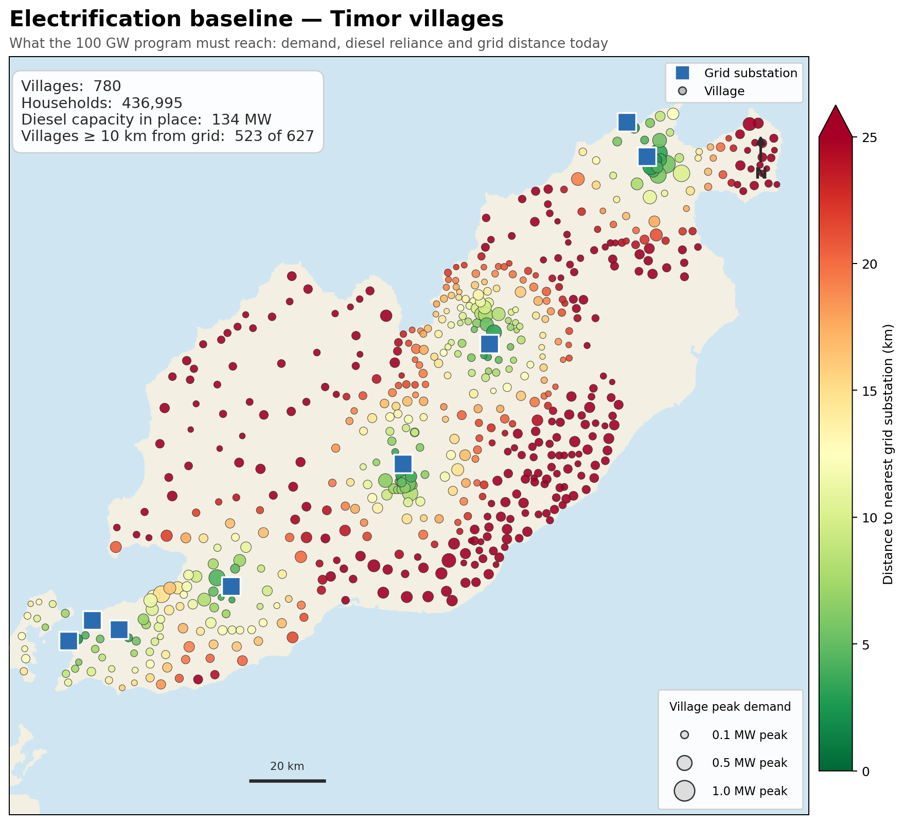
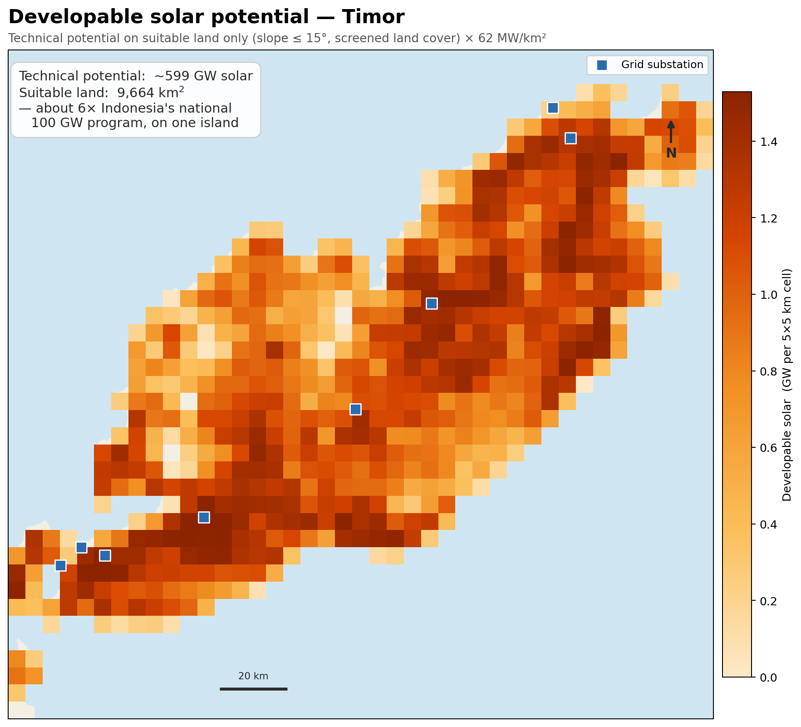
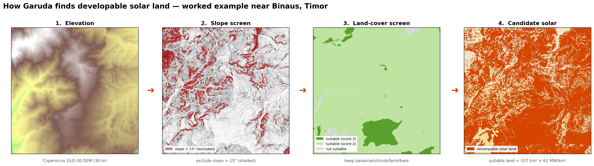
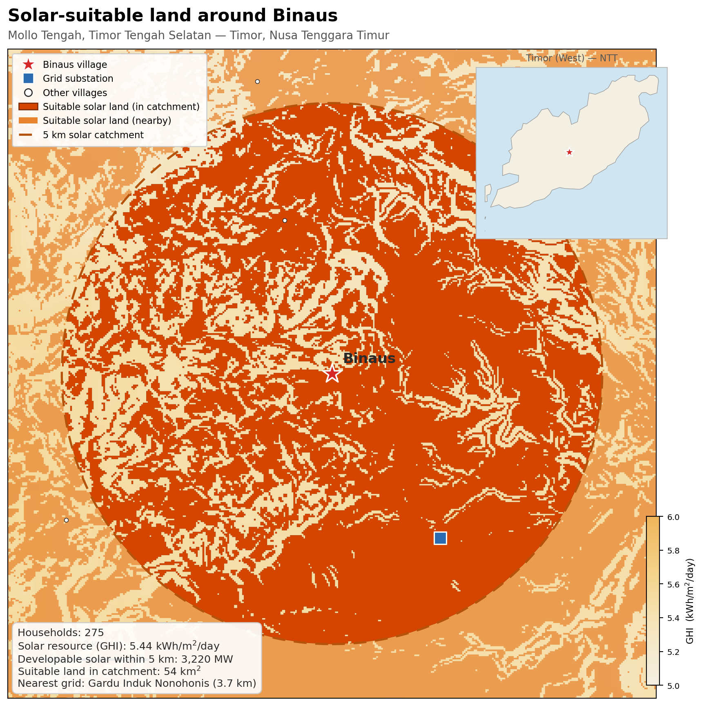
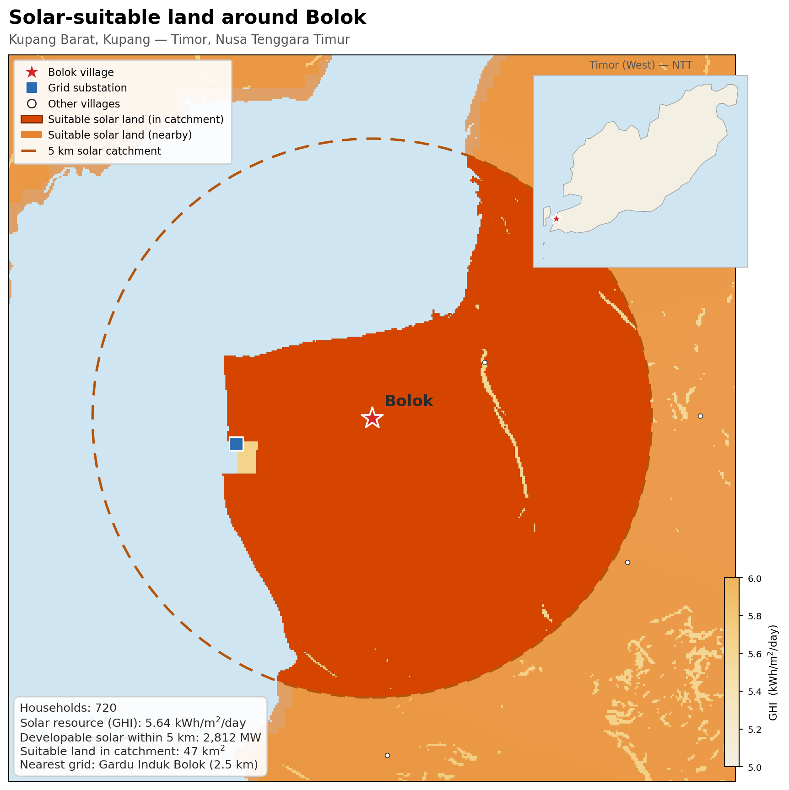
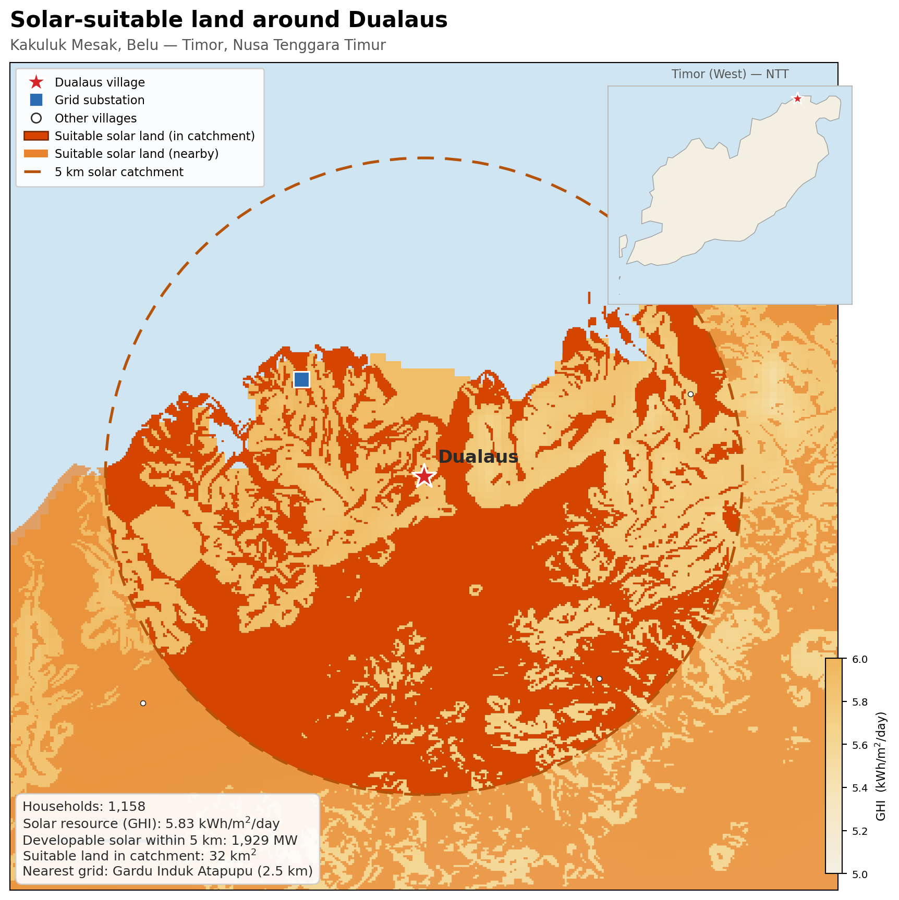
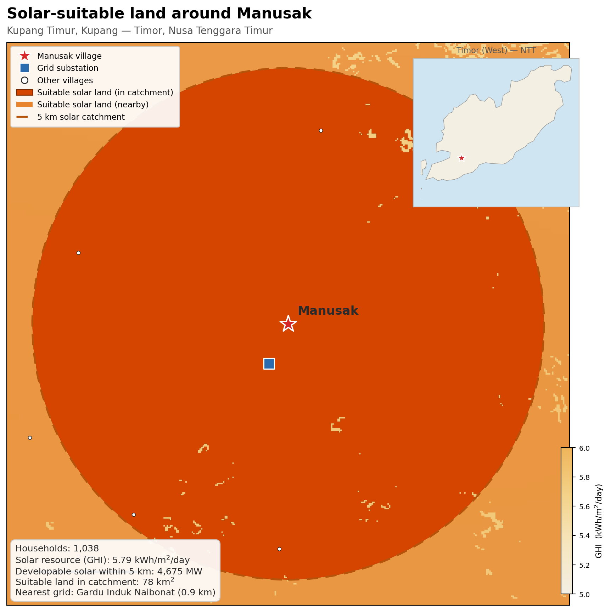
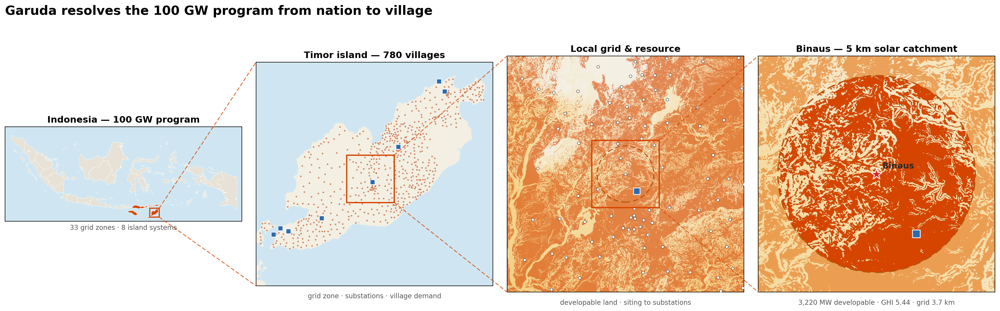

# Case study — Timor / Nusa Tenggara Timur

The Timor / NTT case is Garuda's worked demonstration of site-resolved
planning: **~780 villages** in one grid zone, each with its own demand, diesel
baseline, solar resource and distance to the grid. It is the case the concept
note proposes as a first, reviewable deliverable — small enough to run on a
laptop with the open-source HiGHS solver, concrete enough to check against local
knowledge.

This page walks the analysis from the problem (diesel-dependent villages) to the
model-ready inputs (per-village developable solar) to the multi-scale view that
national models cannot draw. Every figure is regenerable; the commands are
listed. The map figures need external GIS layers that are **not shipped in the
repo** (DEM, GHI raster, candidate-land polygons, substations, land cover) —
point the scripts at your copy with `GARUDA_GIS_DIR` (see `tools/figlib.py`). The
per-village CSVs the figures overlay *are* in the repo
(`data_indonesia/2030/timor/`).

> These are presentation figures, not part of a model run. The model itself
> consumes the CSVs; see [`docs/village_adaptation.md`](village_adaptation.md)
> for the scenarios and [`docs/outputs_guide.md`](outputs_guide.md) for results.

---

## 1. The starting point: diesel dependence

Every village sized by peak demand and coloured by distance to the nearest grid
substation, over the existing substation network — the diesel-dependent baseline
the 100 GW programme must reach. *Generate:*
`python tools/plot_electrification_baseline.py`.

## 2. The opportunity: developable solar

The QGIS suitable-land polygons rasterised to developable MW per cell — a
quantitative "where is the solar" map. The headline compares total developable
capacity to Timor's village peak demand: resource is not the binding constraint.
*Generate:* `python tools/plot_developable_solar.py`.

## 3. How the developable-land number is derived

The siting pipeline behind the per-village ceiling, in four linked panels over
one rugged window: (1) Copernicus GLO-30 elevation, (2) slope screen (≤ 15°),
(3) land-cover screen (savannah / shrub / farm / bare), (4) candidate solar =
slope **and** land-cover suitable, converted at 62 MW/km². This is what turns raw
terrain into the `Max_Cap_MW` land ceiling each village carries in the model.
*Generate:* `python tools/plot_siting_pipeline.py --desa BINAUS`. See
[`docs/resource_siting.md`](resource_siting.md) for the pipeline in full.

## 4. Grounding it in real villages

Four representative NTT villages, each showing its modelled 5 km solar catchment,
the suitable-land polygons that set its developable-PV ceiling, the nearest grid
substation, and an island locator.

| | |
|---|---|
|  |  |
|  |  |

*Generate:* `python tools/plot_village_solar.py --desa BINAUS`
(also `BOLOK`, `DUALAUS`, `MANUSAK`).

## 5. The differentiator: one model, four scales

Nation → island → zone → village in one figure, with connectors showing where
each panel drills into the previous one. This is the resolution national and
regional system models average away, and the reason Garuda sits *below* them
rather than competing: from the 100 GW programme down to a single village's 5 km
solar catchment. *Generate:* `python tools/plot_zoom_pyramid.py --desa BINAUS`.

---

## From figures to a run

The same per-village inputs shown here drive the model. To reproduce the
demonstration end-to-end on HiGHS (no licence), follow
[`docs/demo_walkthrough.md`](demo_walkthrough.md): screen the zone, run the
standalone (`village`) and coordinated (`gridvillage`) scenarios, and quantify
the **coordination value** — the grid reinforcement and diesel avoided when
village solar and grid expansion are planned together — with
[`tools/coordination_value.py`](coordination_value.md).
